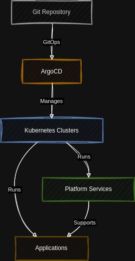
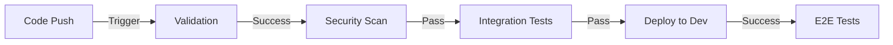

# Enterprise Infrastructure & Platform Engineering

[](https://github.com/your-org/infrastructure/actions)
[](https://github.com/your-org/infrastructure/actions)
[](https://github.com/your-org/infrastructure/actions)

Enterprise-grade infrastructure and platform engineering repository implementing GitOps methodologies, infrastructure as code, and cloud-native best practices. This repository manages both cloud infrastructure and Kubernetes-based platform services across multiple environments and cloud providers.

## 📋 Table of Contents

- [Overview](#overview)
- [Architecture](#architecture)
- [Getting Started](#getting-started)
- [Repository Structure](#repository-structure)
- [Development](#development)
- [Testing](#testing)
- [Security](#security)
- [Operations](#operations)
- [Contributing](#contributing)
- [Support](#support)

## 🎯 Overview

This repository implements a complete infrastructure and platform engineering solution with:

- Multi-cloud support (AWS/GCP)
- GitOps-based deployment workflows
- Enterprise-grade security controls
- Comprehensive monitoring and observability
- Infrastructure as Code (IaC)
- Kubernetes-native service management

## Repository Structure

```
infrastructure/
├── README.md
├── .github/                    # GitHub specific configurations
│   ├── workflows/             # GitHub Actions workflows
│   │   ├── terraform.yaml     # IaC validation and planning
│   │   ├── security-scan.yaml # Security scanning
│   │   └── integration-tests.yaml
│   └── CODEOWNERS
├── clusters/                   # Cluster-specific configurations
│   ├── _templates/            # Reusable cluster templates
│   ├── dev/
│   │   ├── aws/              
│   │   │   ├── apps/         # ArgoCD application manifests
│   │   │   └── cluster.yaml  # Cluster-specific settings
│   │   └── gcp/
│   ├── staging/
│   └── prod/
├── infrastructure/            # Infrastructure as Code (IaC)
│   ├── terraform/            # Terraform configurations
│   │   ├── aws/
│   │   │   ├── modules/      
│   │   │   │   ├── eks/     # EKS cluster module
│   │   │   │   ├── networking/ # VPC, subnets, etc.
│   │   │   │   └── security/   # Security groups, IAM
│   │   │   └── environments/
│   │   │       ├── dev/
│   │   │       ├── staging/
│   │   │       └── prod/
│   │   └── gcp/             # GCP equivalent structure
│   └── pulumi/              # Alternative IaC (optional)
├── platform/                 # Platform-wide services
│   ├── argocd/              # GitOps controller
│   │   ├── base/
│   │   └── overlays/
│   ├── cert-manager/        # Certificate management
│   ├── ingress/            
│   │   ├── nginx/
│   │   └── istio/          # Service mesh
│   ├── logging/            # Logging stack
│   │   ├── elasticsearch/
│   │   ├── fluentd/
│   │   └── kibana/
│   ├── monitoring/         # Monitoring stack
│   │   ├── grafana/
│   │   ├── prometheus/
│   │   ├── alertmanager/
│   │   └── dashboards/     # Grafana dashboards
│   ├── security/          # Security tools and policies
│   │   ├── vault/        # Secrets management
│   │   ├── oauth2-proxy/ # Authentication proxy
│   │   ├── network-policies/
│   │   ├── pod-security-policies/
│   │   └── admission-controllers/
│   └── tools/             # DevOps tools
│       ├── harbor/       # Container registry
│       └── sonarqube/    # Code quality
├── applications/          # Application manifests
│   ├── bases/            # Base configurations
│   │   ├── web/         # Web applications
│   │   ├── api/         # API services
│   │   └── workers/     # Background workers
│   └── overlays/        # Environment overlays
│       ├── dev/
│       ├── staging/
│       └── prod/
├── policies/             # Policy definitions
│   ├── opa/             # Open Policy Agent
│   ├── kyverno/         # Kyverno policies
│   └── gatekeeper/      # Gatekeeper constraints
├── tests/               # Testing frameworks
│   ├── integration/     # Integration tests
│   ├── e2e/            # End-to-end tests
│   ├── performance/    # Performance tests
│   │   ├── k6/        # Load testing
│   │   └── chaos/     # Chaos engineering
│   └── security/       # Security tests
├── docs/               # Documentation
│   ├── architecture/   # Architecture diagrams
│   ├── runbooks/      # Operation runbooks
│   ├── development/   # Development guides
│   └── disaster-recovery/ # DR procedures
└── scripts/           # Utility scripts
    ├── setup/        # Setup scripts
    ├── validation/   # Validation scripts
    └── maintenance/  # Maintenance scripts
```

### Key Features

- 🏗️ **Infrastructure as Code**: Complete infrastructure automation using Terraform/Pulumi
- 🔐 **Security-First Design**: Built-in security controls, policies, and compliance
- 📊 **Observability**: Comprehensive monitoring, logging, and tracing
- 🚀 **GitOps Workflows**: Automated deployment and configuration management
- 🔄 **Multi-Environment**: Development, staging, and production environment parity
- 💼 **Enterprise Ready**: Built for scale, security, and compliance

## 🏛️ Architecture

### Infrastructure Layer


### Component Stack
- **Container Orchestration**: Kubernetes (EKS/GKE)
- **GitOps**: ArgoCD
- **Service Mesh**: Istio
- **Ingress**: NGINX/Istio Gateway
- **Monitoring**: Prometheus, Grafana, Alertmanager
- **Logging**: EFK Stack (Elasticsearch, Fluentd, Kibana)
- **Security**: Vault, Cert-Manager, OPA/Gatekeeper

## 🚀 Getting Started

### Prerequisites

```bash
# Required CLI tools
brew install kubectl terraform helm argocd kubectx stern pulumi
```

### Quick Start

1. **Clone Repository**
```bash
git clone https://github.com/your-org/infrastructure.git
cd infrastructure
```

2. **Install Dependencies**
```bash
make install-tools
```

3. **Local Development Setup**
```bash
make dev-env
```

4. **Deploy Test Environment**
```bash
make test-env
```

### Environment Setup

#### Local Development
```bash
# Start local cluster
make local-up

# Deploy core services
make core-services

# Verify installation
make verify
```

#### Cloud Development (Free Tier)
```bash
# AWS Free Tier Setup
make aws-dev-env

# GCP Free Tier Setup
make gcp-dev-env
```

## 📁 Repository Structure

### Core Directories

```plaintext
infrastructure/
├── clusters/          # Cluster configurations
├── infrastructure/    # IaC definitions
├── platform/          # Platform services
├── applications/      # Application manifests
├── policies/          # Security policies
└── tests/            # Test suites
```

### Key Components

#### Platform Services
- 🔐 **Security Stack**
  - HashiCorp Vault
  - Cert-Manager
  - OAuth2 Proxy
  - OPA/Gatekeeper

- 📊 **Observability Stack**
  - Prometheus
  - Grafana
  - Alertmanager
  - EFK Stack

- 🌐 **Networking Stack**
  - Istio
  - NGINX Ingress
  - Cert-Manager
  - Network Policies

## 💻 Development

### Local Development Flow

1. **Setup Local Environment**
```bash
make dev-setup
```

2. **Code Validation**
```bash
make validate
```

3. **Run Tests**
```bash
make test
```

### CI/CD Pipeline



## 🧪 Testing

### Test Suites

```bash
# Run all tests
make test

# Run specific suites
make test-integration
make test-e2e
make test-security
```

### Test Environments

- **Local**: Kind/Minikube
- **Dev**: AWS/GCP Free Tier
- **Staging**: Minimal Production Clone
- **Production**: Full Environment

## 🔐 Security

### Security Features

- **Infrastructure Security**
  - Private Networks
  - IAM/RBAC
  - Network Policies
  - Security Groups

- **Application Security**
  - Secret Management
  - Certificate Management
  - Policy Enforcement
  - Authentication/Authorization

### Compliance

- **Automated Checks**
  - Security Scanning
  - Policy Validation
  - Compliance Auditing
  - Vulnerability Scanning

## 🛠️ Operations

### Monitoring

- **Metrics Collection**
  - Infrastructure Metrics
  - Application Metrics
  - Business Metrics
  - Cost Metrics

- **Logging**
  - Application Logs
  - Audit Logs
  - Security Logs
  - Access Logs

### Disaster Recovery

- **Backup Procedures**
  - Infrastructure Backup
  - Data Backup
  - Configuration Backup
  - Recovery Testing

## 🤝 Contributing

### Development Flow

1. Fork repository
2. Create feature branch
3. Implement changes
4. Run tests
5. Submit pull request

### Pull Request Process

1. Update documentation
2. Add/update tests
3. Pass all checks
4. Get approvals
5. Merge changes

## 📮 Support

- **Documentation**: `/docs`
- **Issues**: GitHub Issues
- **Slack**: #infrastructure-support
- **Email**: infrastructure@your-org.com

## 📝 License

Copyright © 2024 Your Organization

## 🏆 Best Practices

- ✅ Infrastructure as Code
- ✅ GitOps Workflow
- ✅ Security First
- ✅ Automated Testing
- ✅ Comprehensive Monitoring
- ✅ Disaster Recovery
- ✅ Documentation
- ✅ Cost Optimization

## ⚡ Quick References

```bash
# Common Commands
make help                  # Show all commands
make validate             # Validate configurations
make deploy ENV=dev       # Deploy to environment
make destroy ENV=dev      # Destroy environment
```

## 📊 Status

| Environment | Status | Version |
|-------------|--------|---------|
| Production  | [](https://github.com/your-org/infrastructure) | v1.0.0 |
| Staging     | [](https://github.com/your-org/infrastructure) | v1.0.0-rc1 |
| Development | [](https://github.com/your-org/infrastructure) | v1.0.0-dev |

Would you like me to expand on any section or add more specific details to any part of the README?